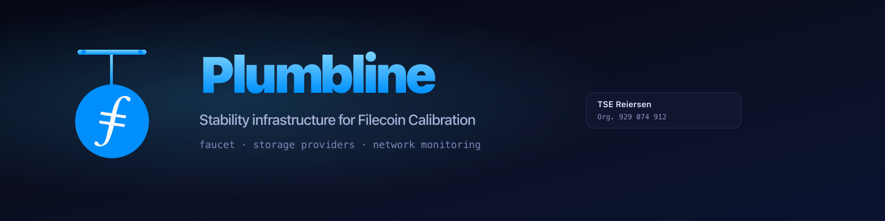

  

# Plumbline

Stability infrastructure for the Filecoin Calibration testnet. The
home of operating storage providers, the public tFIL + USDFC faucet,
and the network-monitoring + nv-upgrade-validation work that keeps
Calibration usable for builders.

This repository is the umbrella: documentation, brand, and roster.
Code for individual services lives in named sibling repos under
`Reiers/plumbline-*`.

---

## Sub-projects

| Repo | What it does |
| --- | --- |
| [`plumbline-faucet`](https://github.com/Reiers/plumbline-faucet) | Public Calibration faucet. tFIL + USDFC drips, served at <https://faucet.reiers.io>. |
| _(soon)_ `plumbline-monitor` | SP uptime + chain health probes that feed the public status page. |
| _(soon)_ `plumbline-cli` | Operator scripts: dispenser top-up, key rotation, Trove management. |

The build order is faucet → monitor → cli. Each sibling repo carries
its own README, license, and CI; the umbrella stays documentation-only
and changes only when the brand or governance changes.

---

## Storage providers

Plumbline operates two long-running Storage Providers on Calibration,
deliberately maintained as stable test targets so that builders,
auditors, and protocol teams have repeatable conditions to test
against across nv-upgrade boundaries.

| SP | Filfox |
| --- | --- |
| `t0143103` | <https://calibration.filfox.info/en/address/t0143103> |
| `t0144416` | <https://calibration.filfox.info/en/address/t0144416> |

The ops cadence:

- **Daily monitoring** of every CalibrationNet node and participating
  miner.
- **Stable infrastructure** — these aren't experimental SPs that
  reset between test campaigns. They're maintained for repeatable
  results.
- **nv upgrade validation** — every network-version upgrade is
  exercised end-to-end on this infra before mainnet adoption.
- **Hundreds of TiBs of QAP** added during peak campaigns by
  combining Curio batch sealing, fast snap deals, and a
  CalibrationNet-optimized Boost.

This work originally lived at
[`The-CalibrationNet-Stability-Project`](https://github.com/Reiers/The-CalibrationNet-Stability-Project).
That repo is now an archived stub pointing here.

---

## Public faucet

`Reiers/plumbline-faucet` runs the public faucet at
<https://faucet.reiers.io>:

- Independent **tFIL** and **USDFC** drips
- 24h cooldown per address per asset
- Single Cloudflare Turnstile gate, on-chain verification of every
  drip before the success modal renders
- Live status page at [`/status`](https://faucet.reiers.io/status)
- 0x ↔ t410f address converter (Tools section)

Source, deploy guide, security model:
<https://github.com/Reiers/plumbline-faucet>.

---

## Contact

For tFIL/USDFC larger than the standard drip, custom amounts, SP-side
debugging, or anything else:

- **DM `@Reiers` on Filecoin Slack** for anything urgent.
- Tag **`@Reiers` in `#fil-net-calibration-discuss`** for bigger
  transfers and SP-side requests.

---

## Brand

The `brand/` directory holds canonical brand assets:

| File | Use |
| --- | --- |
| `brand/logo.svg` | Square icon (used in app navs, favicons) |
| `brand/favicon.svg` | Simplified favicon, optimized for 32×32 |
| `brand/banner.svg` / `.png` | Repo headers (this README's masthead) |
| `brand/og.svg` / `.png` | Square OG card for social shares |

Sub-repos pull these via raw.githubusercontent.com so a brand refresh
propagates without coordinated commits.

---

## Operating organization

**TSE Reiersen** · Org. 929 074 912 (Norwegian enterprise registry)

License: MIT.
